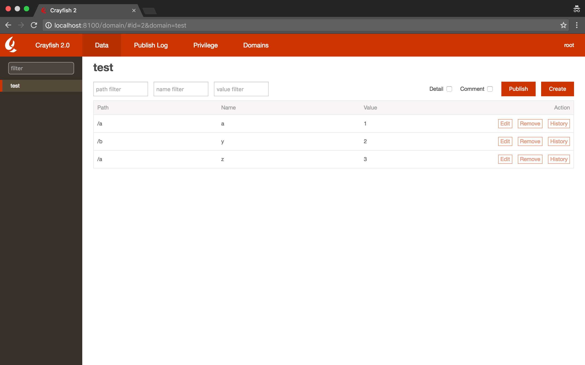

# Crayfish

> Crayfish 是一个将配置发布到 CDN的前端配置管理系统。前端程序直接从 CDN 加载，对后端服务器不会造成任何压力，可被广泛应用于文案、开关管理等。

[文档](https://elemefe.github.io/crayfish/)

## 特点
* 配置在 CDN 上，没有服务器性能瓶颈
* 健壮的权限机制，可以从角色和项目两个维度管理权限
* 配置是有数据类型的，让前端程序可以更准确地使用

## 快速开始

### 1. 依赖

* Node Version: >= 5
* MySQL Version: >= 5.6

**注: MySQL 5.7 请关闭严格模式：<http://dev.mysql.com/doc/refman/5.7/en/sql-mode.html>。**

### 2. 安装与运行

首先为你的 MySQL 准备好一个 `crayfish` 数据库。可以在 `config.js` 和 `MAKEFILE` 中修改数据库。

安装并启动后端，如果没有任何错误，则为运行成功：

```shell
cd backend
make node_modules
make init-database
make run
```

Crayfish 的前端使用 [jinkela](https://github.com/YanagiEiichi/jinkela) 开发，并使用 [webspoon](https://github.com/ElemeFE/webspoon) 构建。

启动前端，前端会被后端的 `koa-static` 中间件加载：

```shell
cd frontend
make install
make dev
```

之后访问：<http://localhost:8100> 即可看到运行成功的 Crayfish。

如果需要在生产环境使用，在根目录 `make build` 即可。

## 截图


